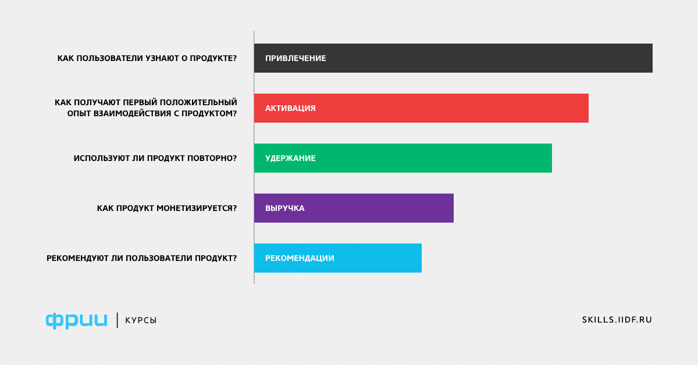

# Метрики вовлечения pt1 {#c2_engagement1}

## Запись занятия {-}

<iframe width="560" height="315" src="https://www.youtube.com/embed/JOM4MLwNCUs?si=gPCEUpSr-1QOdSyj" title="YouTube video player" frameborder="0" allow="accelerometer; autoplay; clipboard-write; encrypted-media; gyroscope; picture-in-picture; web-share" referrerpolicy="strict-origin-when-cross-origin" allowfullscreen></iframe>

## папка с записями в Dropbox

https://www.dropbox.com/scl/fo/pzw6egi6notlmr08vq1wq/ACf8iAANpusI3UcBlOFXoKM?rlkey=y9c0mao5qj2r85q1cgrdrg4oc&st=328vy5sx&dl=0


## AARRR фреймворк {-}



## User Aquisition {-}

Метрики привлечения пользователей в основном используются маркетинговыми аналитиками и специалистами по user aquisition, привлечению пользователей. Продуктовые аналитики в основном работают с метриками стоимости пользователя: CPA (cost per action), CPI (cost per install), хотя иметь представления о прочих метриках тоже надо.

<br>

### Процесс привлечения пользователей {-}

-   рекламодатель (тот, кто хочет привлечь пользователей)

-   аукцион рекламной площадки (рекламная площадка выбирает, кому, когда и по какой цене показыть рекламные материалы)

-   целевые действия (установка, платеж и т.д.) (в зависимости от того, на выполнение какого целевого действия оптимизируется рекламная сеть, в приложение будут приходить разные пользователи - те, кто вероятнее всего установит приложение/сделает платеж / сделает другое целевое действие)

-   управление кампанией - таргетинг, бюджет, креативы (рычагов управления рекламными кампаниями не так уж и много: на кого ориентируем рекламу, какой бюджет в день рекламная сетка может потратить на привлечение пользователей, какие рекламные материалы показываем)

<br>

### Маркетинговая воронка в мобильных приложениях {-}

Когда пользователи видят рекламу, они проваливаются в "воронку" --- последовательность шагов, которые приводят пользователя в приложение. Вообще воронки --- полезный инструмент для оценки, где и на каком этапе отваливается пользователь.

-   реклама (баннер, playable, прочий креатив): CPM (cost per mille - сколько платим за каждые 1000 показов рекламных материалов), CPC (cost per click - сколько платим рекламной сетке за каждый клик по баннеру), СTR(click through rate -- клики / показы)

-   переход в стор

-   установка приложения (CR, conversion rate, регистрации / показы)

-   целевое действие (CPI, CPA)

Для продуктовых аналитиков важнее всего стоимость пользователя (как правило, CPI или CPA), так как это позволяет сопоставить, сколько заплатил пользователь за время своей жизни в приложении и сколько потратили на его привлечение. То есть, окупился пользователь или нет. Оптимизировать окупаемость можно и с помощью понижения цены закупки, и с помощью повышения среднего чека / LTV пользователя. На последнее как раз влияют прождуктовые изменения, которые и входят в зону ответственности продуктовых аналитиков.

<br>

### Новый пользователь {-}

Основная цель рекламных кампаний -- привлечение пользователей в приложение. Одна из базовых метрик этого процесса -- количество новых пользователей. Однако есть сложности с самим определением, что такое новый пользователь. В частности, считать инсталлом новое физическое устройство. Или новый аккаунт пользователя. Или пользователя, который сделал покупку / подписку (e-comm, в частности). Например, когда пользователь на новый телефон устанавливает приложение и туда происходит логин с помощью его гугл/эппл аккаунта. В этом смысле устройство новое (а маркетинг закупает девайсы), а пользователь старый. Или когда пользователь пользовался приложением на телефоне. Потом удалил и через пару лет увидел рекламу и поставил заново и создал новый аккаунт. Или просто отдал телефон кому-то. Девайс старый, а пользователь новый.

Другая история с новыми пользователями -- это механизмы ретаргетинга. Это когда мы стараемся вернуть в приложение пользователей, которые уже были нашими пользователями, но потом отвалились. Например, мы выбираем набор девайсов с каким-то суммарным платежом более X единиц, и просим рекламной сетке именно этим устройствам показать нашу рекламу, с помощью которой мы надеемся вернуть пользователей. Этих пользователей сложно считать новыми, но рекламная кампания на них была и, соответственно, сколько-то мы потратили на возвращение этих пользователей.

<!-- ### Практика {-} -->

<!-- Необходимо подсчитать и нарисовать, сколько пользователей в день приходит в приложение, в том числе и с разбивкой по платформам. Датасет: <https://gitlab.com/hse_mar/mar211f/-/raw/main/data/installs.csv> -->

<!-- ```{r} -->
<!-- library(data.table) -->
<!-- library(plotly) -->

<!-- # импортируем датасет -->
<!-- installs <- fread('https://gitlab.com/hse_mar/mar211f/-/raw/main/data/installs.csv') -->

<!-- # считаем количество уникальных пользователей по дням инсталлов и платформе -->
<!-- installs_stat <- installs[, list(n_users = uniqueN(user_pseudo_id)), -->
<!--                           by = list(dt, platform)] -->

<!-- # сортируем -->
<!-- installs_stat <- installs_stat[order(dt)] -->

<!-- # рисуем график -->
<!-- plot_ly(installs_stat, x = ~dt, y = ~n_users, color = ~platform, -->
<!--         type = 'scatter', mode = 'lines') %>% -->
<!--   layout( -->
<!--     title = 'Новые пользователи в приложении', -->
<!--     xaxis = list(title = 'дата инсталла'), -->
<!--     yaxis = list(title = '', rangemode = 'tozero')) %>% -->
<!--   config(displayModeBar = FALSE) -->
<!-- ``` -->

<!-- ```{r} -->
<!-- # рисуем график area-plot -->
<!-- plot_ly(installs_stat, x = ~dt, y = ~n_users, color = ~platform, -->
<!--         type = 'scatter', mode = 'none', stackgroup = 'one') %>% -->
<!--   layout( -->
<!--     title = 'Новые пользователи в приложении', -->
<!--     xaxis = list(title = 'дата инсталла'), -->
<!--     yaxis = list(title = '', rangemode = 'tozero')) %>% -->
<!--   config(displayModeBar = FALSE) -->
<!-- ``` -->

## Активность и вовлечение {-}

Другая группа метрик - метрики активности и вовлечения пользователей в продукт. К этим метрикам относят обычно количество заходов пользователя в день (количество сессий), количество уникальных пользователей, заходящих в день в приложение. В некоторых случаях считают более длинные метрики - количество уникальных пользователей, зашедших в приложение в последнюю неделю/месяц.

<br>

### DAU, WAU, MAU {-}

**D**aily **A**ctive **U**sers

**W**eekly **A**ctive **U**sers

**M**onthly **A**ctive **U**sers

Основная метрика - DAU, как наиболее гибкая и быстро реагирующая на изменения в продукте. Месячные и недельные метрики считаются в скользящем окне, за последние 30 и 7 дней для каждой даты соответственно.

<br>

### Stickness / Sticky factor {-}

Иногда смотрят отношение DAU/MAU и интерпретируют как метрику залипания пользователя в проект, его лояльности. В целом это метрика вполне хорошо заменяется метриками удержания (retention).

<br>

### Retention rate {-}

Метрика удержания пользователя (retention) --- какая доля пользователей вернулась в приложение. Во многом формула расчета ретеншена зависит от того, что мы считаем точкой отсчета. Когда речь идет о мобильных приложениях развлекательного плана (игры, стриминговые сервисы и проч.), то точкой отсчета обычно считают день инсталла, когда пользователь установил приложения. В некоторых продуктах может быть иначе, например, в e-commerce или в сервисах, предлагающих определенные услуги оффлайн (доставка продуктов), считаются только возвраты тех пользователей, которые сделали уже платеж (возвратом считается последующий платеж).

В целом, метрика удержания одна из важнейших в аналитике - она позволяет понимать, насколько пользователям интересно приложение (сервис), останутся ли они в нем. Соответственно, это прямо влияет на монетизацию: когда пользователи остаются, они либо больше платят, либо, как минимум, есть шансы их побудить сделать платеж (скидками, новыми фичами и т.д.)

Нюансы:

-   install day = day 0: традиционно день инсталла считается нулевым днем.

-   day 1/7/14/28: полезно иметь в виду, что бывают циклы, например, ретеншен в течение недели может варьировать в определенном диапазоне. Соответственно, сравнивать два периода/объекта/тестовых группы хорошо бы по одному и тому же по структуре интервалу.

-   проблема интервала (сутки vs календарная дата): обычно считается ретеншен по календарным дням, то есть, если произошла смена даты, то это уже другой день, даже если пользователь установил приложение в 23.55. Временами встречаются вычисления ретеншена строго по 24 часовым интервалам (вернувшийся в игру через 24 часа). Метрики удержания по этим двум формулам вычисления различаются, всегда надо уточнять, как именно велся расчет.

-   rolling retention: иногда нет возможности логировать каждый заход пользователя в приложение, поэтому используется только дата последнего захода пользователя в приложение - то есть, считается, какая доля пользователей заходила после N дня от инсталла. Иногда `retention 1 дня` / `удержание 1 дня` сокращают до `ret1 / ret1d, r1` (номер дня может быть любым, не только 1).

-   однородность когорт: когда мы считаем удержание по когорте пользователей (например, пришедшим в сентябре), то мы должны считать ретеншен только того дня, который могли прожить все пользователи. То есть, на момент 3 сентября нельзя считать ретеншен 7 дня для тех, кто пришел в приложение 31 августа - они принципиально не могли прожить 7 дней, максимум - 2 (день инсталла и 1-2 октября, 3 сентября также нельзя считать, так как день еще не закончился). Соответственно, по всей месячной когорте можно считать только ret2, даже для тех, кто пришел в начале сентября и мог провести в приложении больше дней. Иногда это минимальное количество дней, которые могли прожить пользователи всех когорт, `называют окном лайфтайма`.

[Google Spreadsheet](https://docs.google.com/spreadsheets/d/1gOUrhSAi-5o2uVrPaGiJHx7Dlh20sP9HUY4_J6RNrKE/edit?usp=sharing) с примерами расчета ретеншена и сравнения дневных когорт.

<!-- ### Практика {-} -->

<!-- Необходимо посчитать удержание пользователей (retention) разных платформ. Датасет: <https://gitlab.com/hse_mar/mar211f_slides/-/raw/main/data/auth.csv> -->

<!-- ```{r} -->
<!-- # импортируем датасет -->
<!-- auth <- fread('https://gitlab.com/hse_mar/mar211f/-/raw/main/data/auth.csv') -->

<!-- # присоединяем инсталлы, чтобы получить дату инсталлов -->
<!-- auth <- merge(auth, installs, by = 'user_pseudo_id', all.x = TRUE) -->

<!-- # вычисляем лайфтайм -- на какой день от инсталла был заход в приложение -->
<!-- auth[, lifetime := as.numeric(login_dt - dt)] -->

<!-- # удаляем странных пользователей, у которых логин был раньше инсталла (реинсталлы) -->
<!-- auth <- auth[!user_pseudo_id %in% auth[lifetime < 0, unique(user_pseudo_id)]] -->

<!-- # считаем количество пользователей по лайфтайму и платформам -->
<!-- auth_stat <- auth[, list(returned = uniqueN(user_pseudo_id)), -->
<!--                   by = list(platform, lifetime)] -->

<!-- # присоединяем, сколько всего было пользователей на этой платформе -->
<!-- auth_stat <- merge(auth_stat,  -->
<!--                    installs[, list(total_users = uniqueN(user_pseudo_id)), by = platform],  -->
<!--                    by = c('platform'), all.x = TRUE) -->

<!-- # вычисляем метрику удержания -->
<!-- auth_stat[, retention := returned / total_users] -->

<!-- # сортируем -->
<!-- auth_stat <- auth_stat[order(lifetime)] -->

<!-- # рисуем график с учетом окна лайфтайма -->
<!-- plot_ly(auth_stat[lifetime <= 30],  -->
<!--         x = ~lifetime, y = ~retention, color = ~platform, -->
<!--         type = 'scatter', mode = 'lines') -->
<!-- ``` -->

<!-- <br> -->

<!-- ### Churn rate -->

<!-- Отвалы (churn, отток) - ситуация, когда пользователь окончательно уходит из приложения. Как правило, это достаточно определить, что пользователь больше не вернется, поэтому операционализируют в духе "отвалившийся пользователь - пользователь, который был неактивен последние N дней". Также как и ретеншен, операционализация отвала может зависеть от приложения и сервиса. -->

<!-- Стоить помнить, что отток не тождественен удержанию с другим знаком, хотя достаточно близок по смыслу. -->

<!-- <br> -->

<!-- ### Sessions per day -->

<!-- Еще одна метрика вовлеченности пользователя в продукт - сколько раз пользователь открывает приложение в течение дня. В более общем виде - какие-то значимые активные действия в единицу времени. -->

<!-- Количество сессий в день можно интерпретировать как степень рутинизированности, включенности в повседневные практики пользователя. Для разных продуктов и сервисов, само собой, будут свои критерии - для игр жанра match3 нормально, если пользователь 4-6 раз в день открывает приложение. А вот для приложения оплаты штрафов или банковских приложений это была бы странная метрика, там вообще могут потребоваться другие способы измерения и вовлечения. -->

<!-- <br> -->

## Полезные материалы {-}

[Статья](https://gopractice.ru/nday-retention-rollling-retention) про Rolling retention и Retention rate от Олега Якубенкова.

[Статья](https://www.devtodev.com/education/articles/ru/325/glavnie-metriki-retention) от dev2dev про Retention.

[Список](https://www.product-frameworks.com/) фреймфорков, которые используют продуктовые менеджеры в своей работе.

Оффтоп: cмешной [случай](https://www.dailymail.co.uk/news/article-8805697/Furious-blame-game-16-000-Covid-cases-missed-Excel-glitch.html), как потеряли информацию о 16 тысячах заболевших граждан. Хороший пример, почему для работы с большими данными (да и просто с данными) Excel не очень полезен.

<br>

## Домашнее задание {-}

Домашние занятия для желающих. Если будут вопросы, пишите в канал #discussion. Если возникнет необходимость получить от меня какие-то персональные комментарии - пишите в личку. 

Задание можете выполнять на любом доступном вам языке / среде для статистики.

### level 1 (IATYTD)

Обновите знания по работе с табличками --- аггрегации (групировки), слияния, создание и модификация колонок.

Ссылка на конспекты прошлого курса: https://mar231s.upravitelev.info/


### level 2 (HNTR)

Необходимо подсчитать и нарисовать, сколько пользователей в день приходит в приложение, в том числе и с разбивкой по платформам. Датасет: <https://gitlab.com/hse_mar/mar211f/-/raw/main/data/installs.csv>

### level 3 (HMP)

Используя датасет по заходам пользователей в приложение (`dau.csv`), подсчитайте и отобразите на графике, сколько пользователей в день заходит в приложение (DAU). [Ссылка на файл](https://gitlab.com/hse_mar/mar211f/-/raw/main/data/dau.csv).
Осторожно, файл около 400мб.

### level 4 (UV)
На основе данных по [логинам](https://gitlab.com/hse_mar/mar211f/-/raw/main/data/dau.csv) нарисуйте [area plot](https://en.wikipedia.org/wiki/Area_chart) DAU проекта, в котором цветами выделите группы пользователей по количеству дней с момента инсталла:

-   группа 1: 0 дней с инсталла

-   группа 2: 1-7 дней с момента инсталла

-   группа 3: 8-28 дней с инсталла

-   группа 4: более 28 дней с инсталла

У вас должно получится что-то вроде слоеного пирога, где цветами выделены группы. Подумайте, есть ли необходимость рисовать этот график не в абсолютных числах (количество пользователей), а в долях каждой группы от DAU, в чем могут быть плюсы и минусы такого графика. Возможно, вам потребуется нарисовать графики разных типов, чтобы ответить на этот вопрос.

Попробуйте подумать, что говорит подобный график о продукте и его пользователях. Есть ли у него проблемные зоны, над которыми надо поработать или которые могут влиять на стратегию развития и/или оперирования продукта?

<br>

### level 5 (N)

Постройте графики DAU, MAU и их отношения для данных за июль. Проинтерпретируйте метрику DAU/MAU, что она говорит о проекте?

<br>
