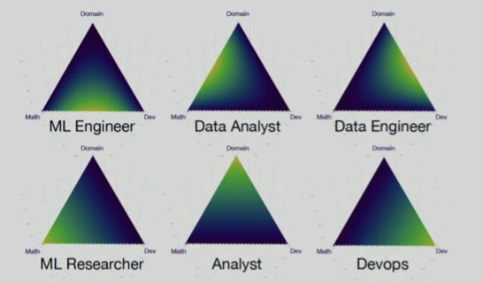
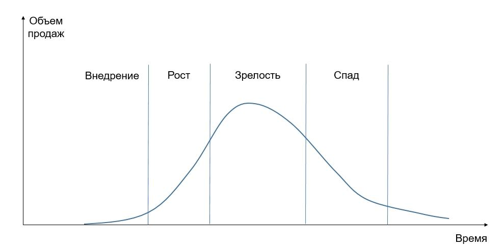

# О курсе и аналитиках {#c1_intro}

## Запись занятия 

<iframe width="560" height="315" src="https://www.youtube.com/embed/O51DUZhU52Q?si=cuLiy6gQ7XCrqp4V" title="YouTube video player" frameborder="0" allow="accelerometer; autoplay; clipboard-write; encrypted-media; gyroscope; picture-in-picture; web-share" referrerpolicy="strict-origin-when-cross-origin" allowfullscreen></iframe>

## Запись в Dropbox

https://www.dropbox.com/scl/fo/pzw6egi6notlmr08vq1wq/ACf8iAANpusI3UcBlOFXoKM?rlkey=y9c0mao5qj2r85q1cgrdrg4oc&st=328vy5sx&dl=0

## Обо мне {-}

 - продуктовый аналитик в Pixonic
 
 - продуктовый аналитик в GameInsight
 
 - аналитик в Консультант+
 
 - аспирант СПбГУ (когнитивная психология)

 

## Contacts {-}

@konhis в telegram

upravitelev@gmail.com (дополнительное средство коммуникации)

 

## О курсе

### основные темы

- Введение в цели и задачи продуктовой аналитики
 
- Метрики активности и вовлечения пользователей
 
- Основы юнит-экономики и метрики монетизации пользователей
 
- Проверка гипотез
 
- А/B-тесты
 
### дополнительные темы

- SQL

- разметка событий

- дашборды

- приглашенные лекторы (UX, аналитика)

- разбор кейсов

### формы контроля

 - две контрольные работы (гугл-формы, закрытые варианты ответа, не надо писать код)
 
 - две домашние работы (предполагают работу с данными и написание кода)
 
 - накопительная оценка по формуле 0.1 * Кр1 + 0.35 * Др1 + 0.2 * Кр2 + 0.35 * Др2, округление арифметическое.
 
 

## Виды аналитиков

### data scientists
Датасаентисты - общее определение нескольких профессий. Основной набор навыков -- математика, программирование и знание бизнес-задач. Сочетание этих навыков в разных пропорциях и характеризует разные виды датасаентистов. Аналитики должны хорошо понимать бизнес-задачи проекта и специфику бизнеса, к тому же сейчас профессия аналитика предполагает хорошее знание статистики и хотя бы начальные навыки программирования.

 

 

### web-аналитика

 - *Задачи*: сбор и анализ данных о посетителях веб-сайтов и их поведении на сайте

 - *Инструменты*: Google Analytics, Яндекс.Метрика, Google Tag Manager

 

### маркетинговая аналитика
 
 - *Задачи*: оценка эффективности маркетинга (UA, привлечение пользователей)
 
 - *Инструменты*: Amplitude, Appsflyer, Facebook etc
 

Есть маркетинговая аналитика, которая касается исследований рынка и так далее. Там совершенно иные требования к навыкам и задачи.

  

### 

## Продуктовая аналитика

### что такое продукт

Все, что может быть предложено на рынке с целью удовлетворения чьих-либо желаний и потребностей. В IT под продуктом обычно понимают приложение или какой-то функционал приложения. Соответственно, продуктовая аналитика --- анализ того, как пользователи взаимодействуют с приложением и предложенным функционалом (и как за него платят). Близко к web-аналитике, но отличается более детальными данными про пользователя и его поведение, а не просто статистику страниц и переходов.

### CX/UX-исследователи

Тоже близки к продуктовым аналитикам, но больше ориентированы на опыт пользователя и то, как он взаимодействует с приложением (интерфейс) и как использует приложение для решения своих задач. Основные методы -- интервью, опросы, фокус-группы, UX-тесты и т.д.

 

### структура команды разработки
Продуктовые аналитики тесно взаимодействуют с командами разработки (особенно если это мобильные приложения), в основном с продюсерами и разработчиками (особенно на этапе построения систем аналитики новых продуктов), с отделом маркетинга, существенно реже - с коммьюнити-менеджерами. 

- продакт-менеджер / продюсер

- проджект-менеджер (PM)

- разработчики (клиент/сервер)

- дизайнеры (арт), UI

- аналитики

- тестировщики

- системные администраторы

- коммьюнити

- саппорт

 

### роли продуктовых аналитиков

- калькулятор

- интерфейс к базе данных

- специалист по дашбордам

- аналитик фич и апдейтов

- генератор идей / мастер на все руки

  

## Стадии развития продукта

### этапы жизни
 

 

### технические этапы

- Концепт

- Прототип

- Продукт, готовый к запуску

- Soft launch

- Global launch

- Оперирование

- Поддержка

Чаще всего, конечно, продуктовые аналитики работают с продуктом в стадии оперирования - когда идет эволюционное развитие, постоянный приток новых пользователей и есть активная команда разработки. Основные задачи: анализ фич (функционала), контроль баланса, улучшение UX, поддержка продактов при проектировании новых фич.

Также аналитики работают с продуктом, готовым к первому запуску и на этапах soft/global launch. Это периоды построения системы аналитики и тестирование, как пользователи реагируют в целом на продукт и на ключевой функционал продукта.

  

## Бизнес-модели

### компоненты

- все, что связано с разработкой и производством продукта

- все, что связано с продажей продукта, от поиска нужных клиентов до распространения продукта

- все, что связано с тем, как клиент будет платить и как компания будет зарабатывать

### варианты

- Subscription Model. Монетизация через подписку. Я.Музыка, онлайн-кинотеатры и т. д.

- Freemium Model. Многие мобильные игры, все продукты с разными тарифными планами.

- Advertising Model. Продукты, которые получают деньги за счет показа рекламы. Социальные сети, Youtube и т. д.

- E-commerce/Marketplace Model. Магазины, маркетплейсы и классифайды.

- Transaction/Commission Model. Монетизация за счет комиссии. AirBnB, платежные системы типа Мир, Visa.

- On-Demand Model. Товар по требованию. Печать книг (Ridero), различный мерч.

- Licensing Model. Продажа лицензий. Microsoft Office.

- Pay-Per-Use Model. Плати и используй. Самокаты, облачные сервисы AWS.

- Crowdsourcing/Funding Model. Живут за счет донатов и пожертвований. Wikipedia.

- ... тысячи их

## Полезные материалы
 
- рассказ Алексея Натекина про виды датасаентистов
<iframe width="560" height="315" src="https://www.youtube.com/embed/lDkTNURDIaY" title="YouTube video player" frameborder="0" allow="accelerometer; autoplay; clipboard-write; encrypted-media; gyroscope; picture-in-picture" allowfullscreen></iframe>

- рассказ Валерия Бабушкина про то, почему датасаентист - очень общий термин
<iframe width="560" height="315" src="https://www.youtube.com/embed/Cs3ae65tmKA" title="YouTube video player" frameborder="0" allow="accelerometer; autoplay; clipboard-write; encrypted-media; gyroscope; picture-in-picture" allowfullscreen></iframe>

 - Неплохая [статья](https://habr.com/ru/company/yandex/blog/447822/) одного из аналитиков Яндекса. Его мысль про партизанской продакт-менеджмент наглядно описывает, какая роль аналитика в команде самая эффективная и, в общем-то, интересная.

 - Хороший доклад про роли аналитиков в продуктовых (в первую очередь геймдев) командах. Немного многословно, но основные пункты освещены.
 <iframe width="560" height="315" src="https://www.youtube.com/embed/Q0SOSZ3LDFg?controls=0" frameborder="0" allow="accelerometer; autoplay; encrypted-media; gyroscope; picture-in-picture" allowfullscreen></iframe>

- [фреймворк](https://medium.com/@daria.sukhareva_53915/product-analytics-framework-adbde61eea44) продуктовой аналитики, основанный на задачах на разных этапах развития продукта. Так как это Medium, может быть недоступен без VPN

- пара слов про бизнес-модели (я частично ориентировался на эти материалы): [раз](https://vc.ru/marketing/55296-12-proryvnyh-biznes-modeley-kotorye-izmenili-rynok), [два](https://tempting.pro/chto_takoe_biznes_modelask_tipy_biznes_modelei/) и [три](https://lpgenerator.ru/blog/2015/05/18/chto-takoe-biznes-model-kakie-biznes-modeli-sushestvuyut-v-internete/)

- [телеграм-канал](https://t.me/startupoftheday) про стартапы, любопытно посмотреть, какие вообще бывают идеи стартапов и на удовлетворение каких потребностей они ориентированы

  

## Домашнее задание {-}
Промежуточные задания необязательны и нужны для тех, кто хочет развивать свои навыки в области аналитики или в R/Python/SQL. О занятиях, которые будут оцениваться, я сообщу отдельно и не один раз.

- Обязательно! Настройте для себя привычную вам рабочую среду для работы с данными (R или Python). Если у вас возникнут какие-то затруднения с этим, напишите мне.

 - В телеграме в подчате #welcome напишите несколько слов о себе: какой опыт работы с R/Python/SQL и вообще языками программирования, есть ли опыт работы аналитиком (и где, если есть). Какие ожидания от курса, какие темы вам интереснее всего.

 - подумайте и напишите мне, каких специалистов и из каких компаний вы хотели бы послушать (кого стоит попробовать пригласить). Не какие-то конкретные люди, а роли.
 
 - посмотрите на ваши установленные приложения и подумайте, какие ваши потребности они реализуют
 
 - попробуйте определить, как организован поток денег от вас к компании в ваших приложениях, за что вы платите и как (какая бизнес-модель используется в этом приложении)
 
 - попробуйте определить самое интересное для себя приложение с точки зрения потребностей и их монетизации, чем оно вам оказалось интересным?
 
 <!-- - метрики и процессы продуктовой аналитики лучше всего разбирать на примере какого-нибудь приложения. Подумайте и напишите, какое приложение вам было бы интересно рассмотреть.  -->

Если это возможно, напишите, пожалуйста, свои размышления о приложениях в подчате #discussion нашего телеграм-канала.

Если есть желание развиваться в сфере аналитики и продуктовой аналитики:

 - напишите мне о своем желании в личку и скажите, какие навыки лично вы хотели бы подтянуть во время курса.

 - поищите различные вакансии веб-аналитиков, продуктовых и маркетинговых аналитиков. Посмотрите требуемые основные навыки: что из этого вы уже умеете, чему хотели бы научиться, а чем даже понятия не имеете. Определите зону или траекторию своего развития. Если считаете, что я могу помочь вам с этим -- напишите, попробуем что-нибудь придумать.
